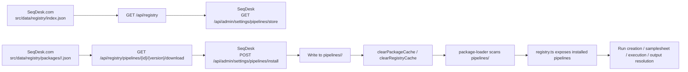

# Pipeline-Store-Integration in SeqDesk

Stand: 2026-03-05

Dieses Dokument beschreibt den aktuellen Integrationspfad fuer Pipelines in SeqDesk, inklusive:

- wie der Pipeline Store (SeqDesk.com) Pipelines bereitstellt
- wie SeqDesk diese Pakete installiert und lokal laedt
- wie der Runtime-Pfad bis zum Run aussieht
- welche Sonderlogik fuer `metaxpath` existiert
- welche Stellen nach aktueller Codebasis wahrscheinlich nicht oder nicht robust funktionieren

## 1. Repositories und Verantwortlichkeiten

| Bereich | Repository | Relevante Orte |
|---|---|---|
| Lokale Pipeline-Integration und Runtime | `SeqDesk` | `src/app/api/admin/settings/pipelines/*`, `src/lib/pipelines/*`, `pipelines/*` |
| Oeffentlicher Pipeline Store / Registry API | `SeqDesk.com` | `src/app/api/registry/*`, `src/data/registry/*` |
| Private MetaxPath-Quelle | `MetaxPath` | `.seqdesk/pipelines/metaxpath/*` |

Wichtig: In SeqDesk ist das installierte Pipeline-Paket unter `pipelines/<id>/` die lokale Source of Truth. Der Store ist nur die Quelle fuer die Installation, nicht fuer die Laufzeit.

## 2. Was ein Pipeline-Paket in SeqDesk ist

Ein Paket besteht lokal aus:

```text
pipelines/<id>/
  manifest.json
  definition.json
  registry.json
  samplesheet.yaml
  parsers/...
  scripts/...
```

Die Semantik ist aktuell:

| Datei | Funktion |
|---|---|
| `manifest.json` | Laufzeitvertrag: Inputs, Outputs, Nextflow-Referenz, Param-Mapping |
| `definition.json` | DAG / Steps / `processMatchers` fuer UI und Progress |
| `registry.json` | UI-Metadaten, Config-Schema, Defaults |
| `samplesheet.yaml` | deklarative Samplesheet-Erzeugung |
| `parsers/*.yaml` | strukturierte Auswertung von Output-Dateien |

Die lokale Paketstruktur wird von `src/lib/pipelines/package-loader.ts` geladen.

## 3. Oeffentlicher Flow: Pipeline aus dem Store nach SeqDesk holen



## 4. Store-Seite: Wo die oeffentliche Pipeline herkommt

### 4.1 Registry-Index

Datei: `../SeqDesk.com/src/app/api/registry/route.ts`

```ts
import { NextResponse } from "next/server";
import registryIndex from "@/data/registry/index.json";

export async function GET() {
  return NextResponse.json(registryIndex, {
    headers: {
      "Cache-Control": "public, s-maxage=300, stale-while-revalidate=600",
    },
  });
}
```

Der Store-Index kommt direkt aus statischen JSON-Dateien in `../SeqDesk.com/src/data/registry/`.

### 4.2 Download eines konkreten Pakets

Datei: `../SeqDesk.com/src/app/api/registry/pipelines/[id]/[version]/download/route.ts`

```ts
const packagePath = path.join(
  process.cwd(),
  "src/data/registry/packages",
  id,
  `${version}.json`
);
const content = await readFile(packagePath, "utf-8");
const payload = JSON.parse(content);

return NextResponse.json(payload);
```

Aktuell ist das kein Build-/Publish-Service, sondern ein statisches Ausliefern von JSON-Dateien aus dem Repo.

### 4.3 Beispiel: aktuelles Store-Paket fuer MAG

Datei: `../SeqDesk.com/src/data/registry/packages/mag/3.0.0.json`

Format:

```json
{
  "files": {
    "manifest.json": "{ ... }",
    "definition.json": "{ ... }",
    "registry.json": "{ ... }",
    "samplesheet.yaml": "..."
  }
}
```

Das Paket ist also ein JSON-Wrapper um die einzelnen Paketdateien, nicht ein Tarball.

## 5. SeqDesk-Seite: Wie der Store gelesen wird

### 5.1 Admin-Store-API

Datei: `src/app/api/admin/settings/pipelines/store/route.ts`

```ts
const STORE_BASE_URL = process.env.SEQDESK_PIPELINE_STORE_URL || 'https://seqdesk.com';
const REGISTRY_URL =
  process.env.SEQDESK_PIPELINE_REGISTRY_URL || `${STORE_BASE_URL}/api/registry`;

export async function GET(_request: NextRequest) {
  const res = await fetch(REGISTRY_URL, { cache: 'no-store' });
  const data = await res.json();
  const pipelines = Array.isArray(data?.pipelines)
    ? data.pipelines.map(normalizePipeline)
    : [];

  return NextResponse.json({
    storeBaseUrl: STORE_BASE_URL,
    registryUrl: REGISTRY_URL,
    pipelines,
    categories,
  });
}
```

Die Admin-UI liest also nicht direkt `SeqDesk.com`, sondern geht ueber die lokale SeqDesk-Proxy-API.

### 5.2 Install-Button in der Admin-UI

Datei: `src/app/admin/settings/pipelines/page.tsx`

```ts
const handleInstallPipeline = async (pipelineId: string, version?: string) => {
  const res = await fetch("/api/admin/settings/pipelines/install", {
    method: "POST",
    headers: { "Content-Type": "application/json" },
    body: JSON.stringify({ pipelineId, version }),
  });
};
```

## 6. SeqDesk-Seite: Wie das Paket installiert wird

Datei: `src/app/api/admin/settings/pipelines/install/route.ts`

Der relevante Pfad fuer oeffentliche Pakete ist:

```ts
const registry = await fetchRegistry();
const pipeline = registry.find((entry) => entry.id === pipelineId);
const download = resolveDownloadUrl(pipeline, version);
const response = await fetch(download.url, { cache: 'no-store' });
const payload = await response.json();

const tempDir = path.join(pipelinesDir, `${pipelineId}.__tmp-${Date.now()}`);
await writePackageFiles(tempDir, payload, pipelineId);

if (exists) {
  const backupDir = path.join(pipelinesDir, `${pipelineId}.__backup-${Date.now()}`);
  await fs.promises.rename(pipelineDir, backupDir);
  await fs.promises.rename(tempDir, pipelineDir);
  await fs.promises.rm(backupDir, { recursive: true, force: true });
} else {
  await fs.promises.rename(tempDir, pipelineDir);
}

clearPackageCache();
clearRegistryCache();
```

### 6.1 Was `writePackageFiles()` akzeptiert

```ts
if (payload.files && typeof payload.files === 'object') {
  for (const [filePathRaw, content] of Object.entries(payload.files as Record<string, string>)) {
    const filePath = resolveStorePath(pipelineDir, filePathRaw);
    await fs.promises.mkdir(path.dirname(filePath), { recursive: true });
    await fs.promises.writeFile(filePath, content, 'utf8');
  }
  return;
}
```

Das passt zum aktuellen Store-Format aus `SeqDesk.com/src/data/registry/packages/...`.

## 7. Wie installierte Pakete lokal geladen werden

Datei: `src/lib/pipelines/package-loader.ts`

### 7.1 Paket-Scan

```ts
export function getPipelinesDir(): string {
  const possiblePaths = [
    path.join(process.cwd(), 'pipelines'),
    path.join(process.cwd(), '..', 'pipelines'),
  ];
  ...
}

const dirs = fs.readdirSync(pipelinesDir, { withFileTypes: true })
  .filter(d => d.isDirectory())
  .filter(d => !d.name.startsWith('.') && !d.name.startsWith('_'))
  .map(d => d.name);
```

### 7.2 Paket-Laden und Validierung

```ts
const manifest = loadJson<PackageManifest>(manifestPath);
const definition = loadJson<DefinitionConfig>(definitionPath);
const registry = loadJson<RegistryConfig>(registryPath);

const validation = validatePackageManifest(packageDir, manifest, definition, registry);

if (!validation.valid) {
  console.error(`Package ${packageId} failed validation - skipping`);
  return null;
}
```

### 7.3 Registry fuer den Rest der App

Datei: `src/lib/pipelines/registry.ts`

```ts
function buildRegistry(): Record<string, PipelineDefinition> {
  const registry: Record<string, PipelineDefinition> = {};

  for (const pkg of getAllPackages()) {
    const def = packageToPipelineDefinition(pkg.id);
    if (def) {
      registry[pkg.id] = def;
    }
  }

  return registry;
}
```

Das bedeutet:

1. Installation schreibt nur Dateien.
2. Erst der naechste Zugriff auf `getAllPackages()` / `PIPELINE_REGISTRY` entscheidet, ob das Paket wirklich benutzbar ist.
3. Wenn die Paketvalidierung fehlschlaegt, ist die Installation technisch "erfolgreich", aber die Pipeline erscheint danach nicht sauber im Runtime-Registry.

## 8. Wie das installierte Paket spaeter im Run verwendet wird

### 8.1 Pipeline-Liste im Admin-Bereich

Datei: `src/app/api/admin/settings/pipelines/route.ts`

```ts
const allPipelineIds = getAllPipelineIds();
const definition = PIPELINE_REGISTRY[pipelineId];
const manifest = getPackageManifest(pipelineId);
```

Die sichtbaren installierten Pipelines kommen nur aus lokal erfolgreich geladenen Paketen.

### 8.2 Samplesheet

Datei: `src/lib/pipelines/samplesheet-generator.ts`

```ts
this.config = getPackageSamplesheet(this.pipelineId);
...
const samples = await db.sample.findMany({ ... });
...
const content = [header, ...dataRows].join('\n');
```

### 8.3 Input-Validierung und Output-Discovery

Datei: `src/lib/pipelines/generic-adapter.ts`

```ts
const pkg = getPackage(packageId);

for (const input of pkg.manifest.inputs) {
  ...
}

const primaryPattern = path.join(outputDir, output.discovery.pattern);
matches = await simpleGlob(primaryPattern);
```

### 8.4 Run-Vorbereitung und Nextflow-Launch

Datei: `src/app/api/pipelines/runs/[id]/start/route.ts`

```ts
const pkg = getPackage(pipelineId);
if (!pkg) {
  return NextResponse.json(
    { error: `Pipeline package not found: ${pipelineId}` },
    { status: 400 }
  );
}

const prepResult = await prepareGenericRun({ ... });
```

Datei: `src/lib/pipelines/generic-executor.ts`

```ts
function resolvePipelineLaunchTarget(pkg: LoadedPackage): PipelineLaunchTarget {
  const pipelineRef = pkg.manifest.execution.pipeline.trim();

  if (pipelineRef.startsWith('/') || pipelineRef.startsWith('./') || pipelineRef.startsWith('../')) {
    return {
      target: path.isAbsolute(pipelineRef)
        ? pipelineRef
        : path.resolve(pkg.basePath, pipelineRef),
      isLocal: true,
    };
  }

  return { target: pipelineRef, isLocal: false };
}
```

Wichtig:

- `mag` nutzt `execution.pipeline = "nf-core/mag"` und zieht den Workflow remote via Nextflow.
- `metaxpath` nutzt `execution.pipeline = "./workflow"` und braucht einen lokalen Workflow-Snapshot im Paket.

### 8.5 Rueckimport der Outputs

Datei: `src/lib/pipelines/run-completion.ts`

```ts
const discovered = await adapter.discoverOutputs({
  runId,
  outputDir,
  samples: ...
});

const result = await resolveOutputs(pipelineId, runId, discovered);
```

Datei: `src/lib/pipelines/output-resolver.ts`

```ts
const destinationHandlers: Record<string, DestinationHandler> = {
  sample_assemblies: createAssembly,
  sample_bins: createBin,
  sample_qc: createArtifact,
  sample_metadata: createArtifact,
  study_report: createArtifact,
  order_report: createArtifact,
  run_artifact: createArtifact,
};
```

## 9. Sonderfall MetaxPath

Es gibt zwei getrennte Wege:

### 9.1 GitHub-Import aus dem MetaxPath-Repo

Datei: `src/app/api/admin/settings/pipelines/metaxpath/github/route.ts`

```ts
await cloneMetaxPathRepository(cloneDir, ref, token, askPassPath);

const descriptorDir = path.join(cloneDir, METAXPATH_DESCRIPTOR_RELATIVE_PATH);
const descriptorValidation = await validateMetaxPathDescriptorDir(descriptorDir);

for (const fileName of REQUIRED_DESCRIPTOR_FILES) {
  await fs.copyFile(
    path.join(descriptorDir, fileName),
    path.join(stageDir, fileName)
  );
}

await fs.cp(sourcePath, destinationPath, { recursive: true });
```

Descriptor-Quelle:

- `../MetaxPath/.seqdesk/pipelines/metaxpath/manifest.json`
- `../MetaxPath/.seqdesk/pipelines/metaxpath/definition.json`
- `../MetaxPath/.seqdesk/pipelines/metaxpath/registry.json`
- `../MetaxPath/.seqdesk/pipelines/metaxpath/samplesheet.yaml`

Der GitHub-Import kopiert also:

1. die Descriptor-Dateien aus `.seqdesk/pipelines/metaxpath/`
2. den eigentlichen Workflow-Snapshot in `pipelines/metaxpath/workflow/`

### 9.2 Privater Tarball-Download

SeqDesk.com stellt dafuer eine private Proxy-API bereit.

Datei: `../SeqDesk.com/src/app/api/private/metaxpath/[version]/route.ts`

```ts
const downloadKey = process.env.METAXPATH_DOWNLOAD_KEY;
const packageUrl = process.env.METAXPATH_PACKAGE_URL;

if (!providedAuthHeader || !safeCompare(providedAuthHeader, expectedAuthHeader)) {
  return NextResponse.json({ error: "Unauthorized" }, { status: 401 });
}

upstreamResponse = await fetch(packageUrl, { cache: "no-store" });
return new NextResponse(upstreamResponse.body, { status: 200, headers });
```

Die lokale Installation erfolgt dann ueber:

- `src/app/api/admin/settings/pipelines/install/route.ts`
- `scripts/install-private-metaxpath.sh`

## 10. Wie der Store aktuell "veroeffentlicht" wird

Nach aktueller Codebasis habe ich **keine dedizierte Publish-API fuer oeffentliche Pipelines** gefunden.

Der heutige Zustand wirkt so:

1. `../SeqDesk.com/src/data/registry/index.json` pflegen
2. `../SeqDesk.com/src/data/registry/pipelines/<id>.json` pflegen
3. `../SeqDesk.com/src/data/registry/packages/<id>/<version>.json` pflegen
4. `SeqDesk.com` deployen

Das ist eine Inferenz aus der vorhandenen Codebasis:

- `GET /api/registry` liest statische Dateien
- `GET /api/registry/pipelines/.../download` liest statische Dateien
- ich habe keine Upload-/Publish-Route fuer oeffentliche Pipeline-Pakete gefunden

## 11. Review-Findings: Was aktuell wahrscheinlich nicht sauber funktioniert

### F1. Das aktuelle MAG-Store-Paket ist mit dem aktuellen SeqDesk-Manifest-Schema inkompatibel

`ManifestSchema` ist strict:

Datei: `src/lib/pipelines/manifest-schema.ts`

```ts
execution: z
  .object({
    type: z.literal("nextflow"),
    pipeline: z.string().min(1),
    version: z.string().min(1),
    profiles: z.array(z.string()),
    defaultParams: z.record(z.string(), z.unknown()),
    paramMap: z.record(z.string(), z.string()).optional(),
    paramRules: z.array(...).optional(),
  })
  .strict(),
```

Das oeffentliche Store-Paket `../SeqDesk.com/src/data/registry/packages/mag/3.0.0.json` enthaelt im eingebetteten `manifest.json` aber zusaetzlich:

- `execution.monitoring`
- `execution.completionDetection`
- `execution.slurmConfig`

Diese Keys sind nach aktuellem Schema unzulaessig. Konsequenz: Der Loader wuerde das Paket nach der Installation verwerfen.

Zusaetzlich gibt es inhaltlichen Drift zwischen dem Store-Paket und dem lokal installierten `pipelines/mag`:

- anderes `registry.category` (`metagenomics` vs. lokal `analysis`)
- andere Platform-Mappings in `manifest.json` / `samplesheet.yaml`
- andere Config-Keys in `registry.json`

Das heisst: selbst wenn das Schema-Problem geloest wird, ist der Store nicht automatisch identisch mit dem derzeitigen lokalen Runtime-Stand.

### F2. Die Install-Route validiert das heruntergeladene Paket nicht vor "success"

Datei: `src/app/api/admin/settings/pipelines/install/route.ts`

```ts
await writePackageFiles(tempDir, payload, pipelineId);
...
clearPackageCache();
clearRegistryCache();

return NextResponse.json({
  success: true,
  message: `Pipeline ${pipelineId} ${exists ? 'updated' : 'installed'} successfully`,
});
```

Es gibt hier **keinen** anschliessenden `loadPackage()`-/`validatePackageManifest()`-Check.

Konsequenz:

- API kann `success: true` zurueckgeben
- danach kann `package-loader` das Paket beim naechsten Zugriff still verwerfen

### F3. Die aktuelle Payload-Form umgeht `assertPackageId()`

Datei: `src/app/api/admin/settings/pipelines/install/route.ts`

```ts
function assertPackageId(payload: Record<string, unknown>, pipelineId: string): void {
  const manifest = payload.manifest as { package?: { id?: string } } | undefined;
  const metaPackage = payload.package as { id?: string } | undefined;
  const payloadId = manifest?.package?.id || metaPackage?.id || (payload.id as string | undefined);
  if (payloadId && payloadId !== pipelineId) {
    throw new Error(`Package ID mismatch. Expected ${pipelineId} but got ${payloadId}.`);
  }
}
```

Das aktuelle oeffentliche Store-Format legt `manifest.json` aber nur als String unter `payload.files["manifest.json"]` ab. Dadurch ist `payloadId` typischerweise `undefined`, und die ID wird **nicht** geprueft.

### F4. Backup-/Temp-Verzeichnisse werden beim Scannen nicht ausgeschlossen

Datei: `src/lib/pipelines/package-loader.ts`

```ts
const dirs = fs.readdirSync(pipelinesDir, { withFileTypes: true })
  .filter(d => d.isDirectory())
  .filter(d => !d.name.startsWith('.') && !d.name.startsWith('_'))
  .map(d => d.name);
```

Die Install-Route verwendet aber Verzeichnisnamen wie:

- `mag.__tmp-<timestamp>`
- `mag.__backup-<timestamp>`

Diese Verzeichnisse beginnen weder mit `.` noch mit `_` und koennen deshalb bei Resten/Fehlerfaellen vom Loader mitgescannt werden.

Zusaetzlich hat der oeffentliche Install-Pfad beim Rename-Swap keinen expliziten Rollback, waehrend der MetaxPath-GitHub-Import einen Restore-Pfad hat. Das macht Fehlerfaelle im oeffentlichen Install-Pfad fragiler.

### F5. Default-URL fuer private MetaxPath-Installation ist veraltet

Datei: `src/app/api/admin/settings/pipelines/install/route.ts`

```ts
const DEFAULT_METAXPATH_PACKAGE_URL = 'https://www.seqdesk.com/private/metaxpath-0.1.0.tar.gz';
```

Diese URL liefert aktuell `404`.

Die vorhandene funktionierende API im Store liegt stattdessen unter:

```text
https://www.seqdesk.com/api/private/metaxpath/0.1.0
```

## 12. Bereits nachvollzogene Checks

### 12.1 Lokale installierte Pakete in SeqDesk

```bash
$ npx tsx scripts/validate-pipeline-package.ts
Checked 2 package(s): 0 error(s), 0 warning(s)
```

Aktuell validiert das nur lokal vorhandene Pakete (`pipelines/mag`, `pipelines/submg`), nicht das Store-Paket in `SeqDesk.com`.

### 12.2 Store-MAG-Manifest gegen aktuelles SeqDesk-Schema

```bash
$ npx tsx -e "import fs from 'fs'; import { ManifestSchema } from './src/lib/pipelines/manifest-schema'; const store=require('../SeqDesk.com/src/data/registry/packages/mag/3.0.0.json'); const result=ManifestSchema.safeParse(JSON.parse(store.files['manifest.json'])); console.log(result.success ? 'ok' : result.error.issues)"
[
  {
    code: 'unrecognized_keys',
    keys: [ 'monitoring', 'completionDetection', 'slurmConfig' ],
    path: [ 'execution' ]
  }
]
```

### 12.3 MetaxPath-Private-URL

```bash
$ curl -I https://www.seqdesk.com/private/metaxpath-0.1.0.tar.gz
HTTP/2 404

$ curl -I https://www.seqdesk.com/api/private/metaxpath/0.1.0
HTTP/2 401
```

Das zweite Ergebnis ist erwartbar, weil die Route Auth verlangt. Das erste zeigt die veraltete Default-URL.

## 13. Empfehlung fuer das Senior-Developer-Review

Ich wuerde den Review in dieser Reihenfolge fahren:

1. Store-Paketformat gegen `ManifestSchema` und Loader-Vertrag pruefen.
2. Install-Route so aendern, dass sie nach dem Schreiben ein echtes Paket-Validation-Gate hat.
3. `assertPackageId()` fuer das aktuelle `payload.files["manifest.json"]`-Format hart machen.
4. Temp-/Backup-Ordner explizit vom Paket-Scan ausschliessen.
5. Store-Publishing mit einem echten Contract-Test zwischen `SeqDesk.com` und `SeqDesk` absichern.
6. MetaxPath-Default-URL auf die vorhandene `/api/private/metaxpath/<version>`-Route umstellen.

Wenn wir nur einen einzigen Punkt sofort pruefbar machen wollen, dann ist es dieser:

> Das aktuell veroeffentlichte `mag`-Paket im Store ist nach der aktuellen SeqDesk-Schema-Definition nicht installierbar, obwohl die Install-API wahrscheinlich `success: true` melden wuerde.
