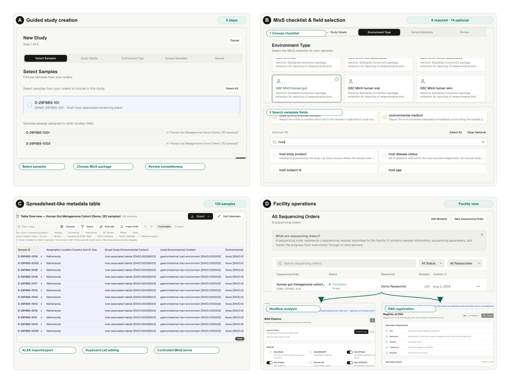

# Designer brief — SeqDesk Figure 1

## Purpose

Create a clear, publication-ready four-panel overview of SeqDesk. The figure
should communicate one continuous story:

> Researchers create a study and capture standards-compliant metadata early;
> sequencing-facility staff then track the work, run analyses, and publish the
> resulting data to ENA.

The figure is for a scientific application note. It should look like a figure,
not a collage of full browser screenshots.

## Current working draft

The draft is a content reference, not the final visual design.

### Problems to improve

1. **Too much small interface text.** At final print size, many labels and table
   values will be difficult to read.
2. **Panel D is overloaded.** Order tracking, Nextflow, and ENA are all important,
   but three screenshots currently compete for attention.
3. **Some crops still contain demo-specific clutter.** Remove the demo warning
   banner, footer clock, `DEMO` badge, random workspace prefixes, and controls
   that do not support the panel's message.
4. **The hierarchy is weak.** Each panel needs one dominant message and no more
   than two short callouts.
5. **The screenshots need more aggressive cropping.** Show the relevant control
   and enough surrounding UI to establish context; do not reproduce whole pages.
6. **Avoid tiny outlined pills as the primary explanation.** Prefer direct labels
   with simple leader lines or short numbered annotations.

## Overall layout

- Four panels in a balanced 2 × 2 grid, labelled **A–D**.
- Target aspect ratio: **4:3**.
- Suggested printed size: **178 × 133.5 mm**.
- Use a white background with generous gutters.
- Panel letters should remain visible at journal-column scale.
- Use screenshots in light mode.
- Use the existing SeqDesk visual language: warm neutral surfaces, charcoal text,
  and restrained green/teal accents.
- Do not invent a new logo or decorative DNA imagery.
- Prefer one main screenshot per panel. Use an inset only where it adds essential
  information.

## Panel A — Guided study creation

### Message

SeqDesk captures the required study and sample information through a guided
five-step workflow, before public submission becomes a separate retrospective
task.

### Show

- The `New Study` screen.
- The complete five-step progress rail:
  1. Select Samples
  2. Study Details
  3. Environment Type
  4. Sample Metadata
  5. Review
- A small part of the active step below the rail, sufficient to show that this is
  a working form rather than a conceptual diagram.

### Emphasize

- **Five guided steps**
- **Metadata captured during study creation**

### Remove or de-emphasize

- Demo warning banner and reset button
- Sidebar and footer
- Long lists of samples
- Random demo identifiers

### Source

- [`screenshots/panel-a-study-workflow.jpg`](./screenshots/panel-a-study-workflow.jpg)

## Panel B — MIxS checklist and field selection

### Message

The researcher selects an environment-specific MIxS checklist. SeqDesk then
distinguishes required and optional fields and lets the user search the relevant
metadata fields.

### Show

Use two tightly related crops from the same workflow step:

1. `GSC MIxS human gut` selected among the environment packages.
2. The metadata-field area with:
   - `Optional (74)`
   - the field-search box containing `host`
   - two or three matching host-related fields

The figure may join these crops vertically with a subtle arrow or numbered
labels. They should still read as one interface and one action sequence.

### Emphasize

- **Environment-specific checklist**
- **8 required + 74 optional fields**
- **Searchable field selection**

### Important accuracy rule

The checklist-card grid itself is not searchable. Search applies to the metadata
field list after a checklist has been selected. Do not label the entire checklist
selector as a searchable checklist browser.

### Sources

- [`screenshots/panel-b-checklist-selected.jpg`](./screenshots/panel-b-checklist-selected.jpg)
- [`screenshots/panel-b-field-search.jpg`](./screenshots/panel-b-field-search.jpg)

## Panel C — Spreadsheet-like metadata table

### Message

SeqDesk supports efficient metadata work at cohort scale while keeping MIxS
terms, sequencing information, and sample identity connected.

### Show

- The fullscreen `Table Overview` from the 120-sample human-gut cohort.
- Four to six representative rows.
- Approximately five informative columns, prioritizing:
  - Sample ID or sample name
  - Geographic location
  - Broad-scale environmental context
  - Local environmental context
  - Environmental medium
- Keep the source-colour legend if it remains readable.
- Keep one glimpse of `Import XLSX`, `Export`, or direct-edit guidance.

### Emphasize

- **Keyboard/direct cell editing**
- **XLSX import and export**
- **Controlled MIxS/ENVO terms**

### Important accuracy rule

Describe this as a **spreadsheet-like metadata table**. The current implementation
uses TanStack React Table; it is not powered by Handsontable.

### Remove or de-emphasize

- More than six rows
- Columns unrelated to the metadata story
- Horizontal-scroll artifacts or clipped identifiers
- Demo badge and footer

### Source

- [`screenshots/panel-c-mixs-table.jpg`](./screenshots/panel-c-mixs-table.jpg)

## Panel D — Facility operations, analysis, and publication

### Message

The facility workspace connects operational tracking with downstream Nextflow
analysis and ENA publication.

### Preferred composition

Use the facility order list as the main crop. Add two small, clearly subordinate
insets:

- **Nextflow analysis:** the MAG pipeline screen with execution target and the
  start control visible.
- **ENA registration:** the submission-requirements screen showing `All passed`.

The order list should occupy roughly two thirds of the panel. The two insets
should share the remaining area and use the same size and treatment.

If this remains too dense, simplify to one facility study-workspace screenshot
with the `Analysis` and `Publishing` navigation visible, plus only one ENA inset.

### Emphasize

- **Order and sample tracking**
- **Nextflow analyses**
- **ENA registration and submission**

### Important accuracy rules

- Do not call `/admin` an administrative dashboard. The operational story spans
  orders, studies, analysis, and publishing.
- Do not claim that status workflows are user-customizable in this panel.
- The demo is view-only, so disabled launch/submission buttons are expected. Do
  not edit them to look enabled.
- Do not invent accessions, pipeline results, or submission confirmations.

### Sources

- [`screenshots/panel-d-facility-orders.jpg`](./screenshots/panel-d-facility-orders.jpg)
- [`screenshots/panel-d-pipeline.jpg`](./screenshots/panel-d-pipeline.jpg)
- [`screenshots/panel-d-ena.jpg`](./screenshots/panel-d-ena.jpg)

## Annotation and typography guidance

- Use no more than **two annotations per panel**.
- Keep annotation phrases short: ideally three to six words.
- Use solid leader lines; avoid decorative arrows or speech bubbles.
- Do not cover interface labels with annotations.
- At final print size:
  - panel letters: approximately 10–11 pt, bold
  - panel headings: approximately 9–10 pt, semibold/bold
  - annotations: at least 7.5–8 pt
- Retain status icons or text so meaning never depends on colour alone.
- Suggested accent: dark teal `#006B57`.
- Suggested neutrals: foreground `#171717`, borders `#D9D9D4`, warm panel
  background `#F7F7F4`.

## Scientific and editorial constraints

- Use only the supplied genuine demo screenshots.
- Cropping, scaling, masking, and subtle contrast correction are allowed.
- Do not change displayed values or create UI states that did not exist.
- Do not add fake ENA accession numbers or simulated service responses.
- Avoid claims that are not visible in the current application.
- Keep the terminology `Study`, `Sequencing Order`, `MIxS`, `Nextflow`, `ENA`,
  and `SubMG` consistent with the manuscript.

## Proposed final caption

**Figure 1. SeqDesk platform overview and key interfaces.** (A) A five-step
study workflow guides users from sample selection and study details through MIxS
environment selection, per-sample metadata entry, and final review. (B) The
registry-driven MIxS selector presents environment-specific checklists and
distinguishes required from optional fields, with field search and a live
selection count. (C) The spreadsheet-like metadata table supports keyboard
editing, XLSX import and export, and cell-level validation; required fields are
marked with asterisks. (D) The facility workspace links order and study tracking
with Nextflow analyses and ENA registration and data submission through SubMG.

## Accessibility alt text

Four-panel overview of SeqDesk showing the five-step study workflow, selection
of a MIxS environmental checklist and metadata fields, spreadsheet-style cohort
metadata editing, and the facility workspace for order tracking, Nextflow
analysis, and ENA registration.

## Required deliverables

1. Editable design source with linked or embedded screenshots.
2. Vector PDF or SVG master with fonts embedded or outlined.
3. 4200 × 3150 px PNG or LZW-compressed TIFF in sRGB.
4. Separate A–D panel exports.
5. A reduced-size proof for manuscript review.

Before delivery, verify that all text remains legible when the complete figure is
displayed at approximately 178 mm wide.
